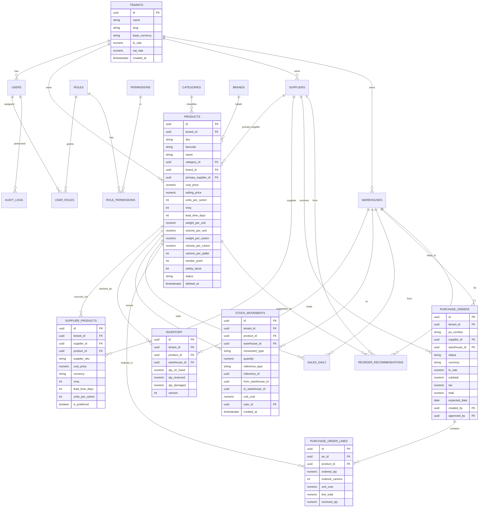
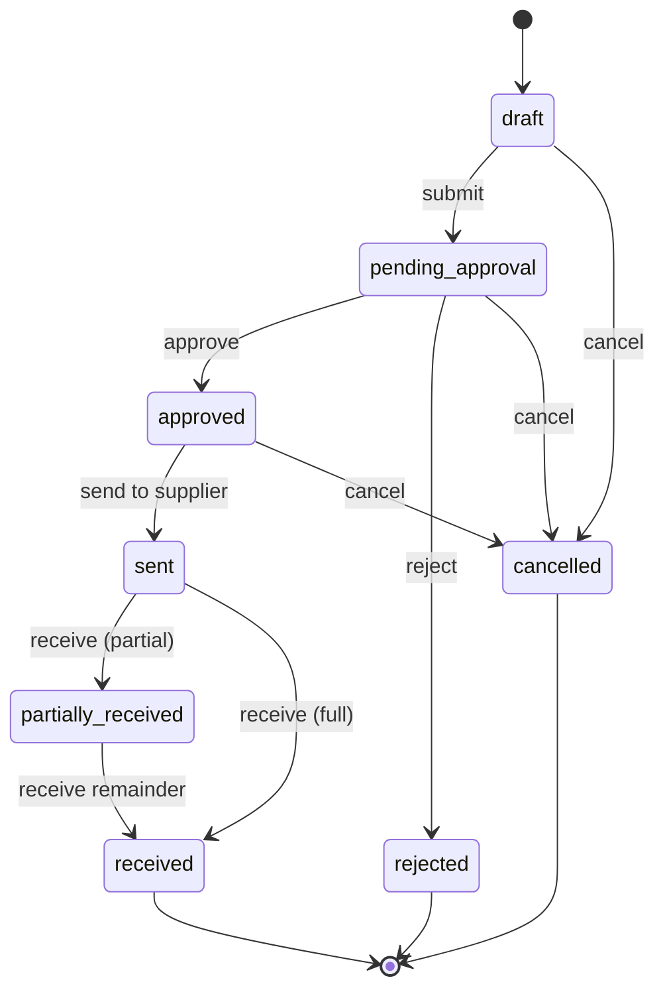

# Inventory Management & Procurement Platform
## Complete Implementation Blueprint — Phase 1 (MVP) + Forward Architecture

**Document type:** Engineering & product blueprint (pre-build)
**Stack:** Python / FastAPI · PostgreSQL · React / TypeScript · Redis · Docker
**Target market:** Distributors, wholesalers, importers, retailers, spare-parts businesses, hardware stores, supermarkets, electronics & toy distributors
**Status:** Blueprint for approval — no production code generated yet

---

## How to read this document

This is the full pre-build specification. It is meant to be handed to a developer (or a small team) and acted on directly. Every section is concrete: real schema, real folder layouts, real endpoint contracts, real reorder math. Where I made a design decision on your behalf, I state the decision and the reasoning inline so you can override it before we write a line of code.

A note on scope discipline: the spec you wrote describes a product that, fully built, is a multi-year effort competing with Cin7, Unleashed, Fishbowl, Zoho Inventory and the inventory modules of NetSuite/SAP. That is the right *vision*. This blueprint deliberately separates **what we build first (MVP)** from **what the architecture must not block (future)**. Pallet/container fields, for example, are stored from day one but not yet used by any algorithm — exactly as you specified.

---

## Table of Contents

1. [System Architecture](#1-system-architecture)
2. [Technology Stack & Rationale](#2-technology-stack--rationale)
3. [Multi-Tenancy & Data Isolation](#3-multi-tenancy--data-isolation)
4. [Database Design](#4-database-design)
5. [ERD](#5-erd-entity-relationship-diagram)
6. [Full SQL Schema](#6-full-sql-schema-postgresql)
7. [Backend Folder Structure](#7-backend-folder-structure)
8. [Frontend Folder Structure](#8-frontend-folder-structure)
9. [API Specification](#9-api-specification)
10. [The Reorder Engine — Formulas & Algorithms](#10-the-reorder-engine)
11. [Purchase Order Engine](#11-purchase-order-engine)
12. [Security & RBAC](#12-security--rbac)
13. [User Flows](#13-user-flows)
14. [Wireframes](#14-wireframes)
15. [Reporting Module](#15-reporting-module)
16. [Non-Functional Requirements](#16-non-functional-requirements)
17. [Development Roadmap](#17-development-roadmap)
18. [MVP Scope (locked) vs Future Roadmap](#18-mvp-scope-vs-future-roadmap)

---

## 1. System Architecture

The system is a **multi-tenant SaaS** built on a **layered (clean) architecture**. Each layer has one job and depends only on the layer beneath it, which is what keeps the codebase testable and lets us swap implementations (e.g., replace the simple reorder model with a statistical one) without touching the API or UI.

```
                          ┌─────────────────────────────────┐
                          │      React + TypeScript SPA       │
                          │  (Vite, TanStack Query, Tailwind) │
                          └──────────────┬────────────────────┘
                                         │ HTTPS / JSON (REST)
                                         │ Bearer JWT
                          ┌──────────────▼────────────────────┐
                          │           API Gateway / LB          │
                          │        (Nginx / Traefik, TLS)       │
                          └──────────────┬────────────────────┘
                                         │
        ┌────────────────────────────────▼─────────────────────────────────┐
        │                        FastAPI Application                         │
        │  ┌───────────┐   ┌────────────┐   ┌──────────────┐   ┌─────────┐  │
        │  │  API /    │ → │  Service   │ → │  Repository  │ → │  Models │  │
        │  │ Routers   │   │   Layer    │   │    Layer     │   │ (ORM)   │  │
        │  └───────────┘   └────────────┘   └──────────────┘   └─────────┘  │
        │   validation       business         data access        SQLAlchemy │
        │   (Pydantic)        rules / math     queries            entities   │
        │                                                                    │
        │  Cross-cutting: Auth/JWT · RBAC · Logging · Error handling · Audit │
        └───────┬───────────────────────────────┬───────────────┬──────────┘
                │                               │                │
        ┌───────▼────────┐            ┌─────────▼───────┐   ┌────▼─────────┐
        │   PostgreSQL    │            │      Redis       │   │ Object Store │
        │  (primary DB +  │            │  cache + broker  │   │ (S3 / MinIO) │
        │   Row Level Sec)│            │                  │   │ exports/docs │
        └─────────────────┘            └─────────┬────────┘   └──────────────┘
                                                 │
                                       ┌─────────▼──────────┐
                                       │  Background Workers │
                                       │  (Celery / RQ)      │
                                       │  • nightly reorder  │
                                       │    recalculation    │
                                       │  • PO generation    │
                                       │  • report exports   │
                                       │  • email/notify     │
                                       └─────────────────────┘
```

**Why each piece exists**

- **React SPA** — the product is data-table heavy with lots of filtering, inline editing and dashboards. A single-page app gives the snappy, app-like feel commercial buyers expect.
- **FastAPI** — async, fast, automatic OpenAPI docs (huge for selling to technical buyers and for your own integrations later), first-class Pydantic validation.
- **PostgreSQL** — transactional integrity is non-negotiable for inventory. Stock movements must be ACID; you cannot have a receipt half-recorded. Postgres also gives us `NUMERIC` for money, row-level security for tenant isolation, and rich indexing.
- **Redis** — caches dashboard aggregates (which are expensive to compute live) and acts as the message broker for background jobs.
- **Background workers** — the reorder engine should run on a schedule (e.g., nightly) across all products, not block a web request. PO generation, report exports and emails are also async.
- **Object storage** — generated PO PDFs and report exports (CSV/XLSX) live here, not in the database.

**Request lifecycle (the contract every endpoint follows)**

1. Request hits a **Router** → Pydantic validates the input shape and types.
2. A **dependency** authenticates the JWT, loads the current user + tenant, and checks the required permission (RBAC).
3. The router calls a **Service** method. Services hold the business rules (carton rounding, MOQ, reorder math, PO totals). Services never write raw SQL.
4. Services call **Repositories**. Repositories are the only place that touches the ORM/DB. This is what makes services unit-testable with a fake repo.
5. Every state change writes an **audit log** entry and, where relevant, a **stock movement** ledger row in the **same transaction**.
6. The response is serialized through a Pydantic **schema** (so we never leak internal fields).

---

## 2. Technology Stack & Rationale

| Layer | Choice | Why |
|---|---|---|
| Language (backend) | Python 3.12 | Mature, readable, excellent data/AI ecosystem for the forecasting phase |
| API framework | FastAPI | Async, auto OpenAPI/Swagger, Pydantic validation, fast |
| ORM | SQLAlchemy 2.0 (async) | Industry standard, repository-friendly, supports complex queries |
| Migrations | Alembic | Versioned, reversible schema changes — required for SaaS upgrades |
| Validation | Pydantic v2 | Type-safe request/response contracts |
| Auth | JWT (access + refresh) via `python-jose`, `passlib[bcrypt]` | Stateless, scalable |
| DB | PostgreSQL 16 | ACID, NUMERIC money, RLS, JSONB for audit diffs |
| Cache / Queue | Redis 7 | Cache + Celery broker |
| Workers | Celery (or RQ for a lighter start) | Scheduled & async jobs |
| Frontend | React 18 + TypeScript | Type safety end-to-end, large talent pool |
| Build | Vite | Fast dev, modern bundling |
| Server state | TanStack Query (React Query) | Caching, background refetch, optimistic updates |
| Client state | Zustand | Lightweight global state (auth, UI prefs) |
| Forms | React Hook Form + Zod | Performant forms, schema validation mirroring backend |
| UI styling | Tailwind CSS + Radix UI / shadcn-style components | Commercial-grade, accessible, fast to build |
| Tables | TanStack Table | Sorting, filtering, pagination, column control |
| Charts | Recharts | Dashboard KPIs and trends |
| Containerization | Docker + docker-compose | Reproducible dev & deploy |
| Testing (BE) | pytest + httpx | Unit + integration |
| Testing (FE) | Vitest + React Testing Library + Playwright | Unit + E2E |
| Observability | structlog (JSON logs) + Sentry + Prometheus/Grafana | Production monitoring |
| CI/CD | GitHub Actions | Lint, test, build, deploy |

**Decision — money type:** all monetary and quantity-cost fields use PostgreSQL `NUMERIC(18,4)`, never floats. Floating point on money is a recurring source of cents-level reconciliation bugs; for a system you'll sell to businesses doing real procurement, that's unacceptable.

**Decision — base currency + FX:** mirroring the dual-currency pattern you already use in your Excel systems, each tenant has a `base_currency`, a `fx_rate`, and a `vat_rate` stored as tenant settings. Suppliers and POs can be in a foreign currency; the system stores both the foreign amount and the base-currency conversion at time of transaction.

---

## 3. Multi-Tenancy & Data Isolation

**Decision: shared database, shared schema, `tenant_id` on every business table + PostgreSQL Row-Level Security (RLS).**

| Model | Pros | Cons | Verdict |
|---|---|---|---|
| Database per tenant | Strongest isolation | Expensive, hard to migrate hundreds of DBs | Overkill for MVP |
| Schema per tenant | Good isolation | Migration & connection complexity at scale | Defer |
| **Shared schema + tenant_id + RLS** | Simple ops, cheap, one migration path | Must be disciplined about filtering | **Chosen** |

Every business table carries `tenant_id UUID NOT NULL`. We enable RLS so that even a coding mistake cannot leak another tenant's rows: the database itself enforces `tenant_id = current_setting('app.current_tenant')`. The app sets that session variable from the JWT on each request. This is defense-in-depth — the repository layer also always filters by tenant, but RLS is the backstop.

For a buyer who later demands physical isolation (enterprise contracts), the architecture allows promoting a tenant to its own database without rewriting application logic, because all access already goes through the repository layer.

---

## 4. Database Design

The schema is organized into six logical groups:

1. **Tenancy & Identity** — `tenants`, `users`, `roles`, `permissions`, `role_permissions`, `user_roles`, `audit_logs`
2. **Catalog** — `categories`, `brands`, `products`, `suppliers`, `supplier_products`
3. **Locations** — `warehouses`, (future) `warehouse_locations`
4. **Stock** — `inventory`, `stock_movements`
5. **Demand** — `sales_daily` (feeds the reorder engine)
6. **Procurement** — `purchase_orders`, `purchase_order_lines`, `reorder_recommendations`

### Key modeling decisions

- **`inventory` is one row per (product, warehouse)** holding `qty_on_hand`, `qty_reserved`, `qty_damaged`. **Available** is a derived value: `on_hand − reserved − damaged`. We never store "available" — it's always computed, so it can't drift out of sync.
- **`stock_movements` is an append-only ledger.** Receipts, issues, adjustments, transfers and damage are all rows here. The `inventory` table is effectively a fast cache of the ledger's running balance, updated transactionally with each movement. This gives you a complete, immutable audit trail and the ability to reconstruct stock at any point in time.
- **Supplier-specific terms live in `supplier_products`,** not just on the product. The same product can be bought from multiple suppliers, each with its own cost, currency, MOQ, lead time and pack size. The `products` table holds the *default/primary* values; `supplier_products` holds the per-supplier reality. This is the difference between a toy and a tool — real importers multi-source.
- **Pallet/container fields (`cartons_per_pallet`, `pallet_weight`, `pallet_volume`, `carton_weight`, `carton_volume`, `weight_per_unit`, `volume_per_unit`) are stored from day one** but unused by any MVP algorithm — exactly per your Rules #3 and #4. Phase 3 container optimization reads them with no schema change.
- **Soft deletes** via `deleted_at` on catalog tables (products, suppliers) so historical POs and movements never break referential integrity. Stock and PO records are never hard-deleted.
- **Optimistic concurrency** via a `version` column on `inventory` and `purchase_orders` to prevent two users clobbering each other's edits.

---

## 5. ERD (Entity Relationship Diagram)



---

## 6. Full SQL Schema (PostgreSQL)

This is production-shaped DDL: UUID primary keys, `NUMERIC` money, foreign keys, check constraints, composite uniqueness scoped to tenant, and indexes on every column you'll filter or join on. In production these are generated and versioned through Alembic migrations; the raw DDL is shown here for review.

```sql
-- ============================================================
-- EXTENSIONS
-- ============================================================
CREATE EXTENSION IF NOT EXISTS "pgcrypto";   -- gen_random_uuid()
CREATE EXTENSION IF NOT EXISTS "pg_trgm";     -- fuzzy SKU/name search

-- ============================================================
-- 1. TENANCY & IDENTITY
-- ============================================================
CREATE TABLE tenants (
    id              UUID PRIMARY KEY DEFAULT gen_random_uuid(),
    name            TEXT NOT NULL,
    slug            TEXT NOT NULL UNIQUE,
    base_currency   CHAR(3) NOT NULL DEFAULT 'USD',
    fx_rate         NUMERIC(18,6) NOT NULL DEFAULT 1,    -- base per 1 foreign, default settings
    vat_rate        NUMERIC(6,4)  NOT NULL DEFAULT 0,    -- e.g. 0.1600 for 16%
    is_active       BOOLEAN NOT NULL DEFAULT TRUE,
    created_at      TIMESTAMPTZ NOT NULL DEFAULT now(),
    updated_at      TIMESTAMPTZ NOT NULL DEFAULT now()
);

CREATE TABLE users (
    id              UUID PRIMARY KEY DEFAULT gen_random_uuid(),
    tenant_id       UUID NOT NULL REFERENCES tenants(id) ON DELETE CASCADE,
    email           CITEXT NOT NULL,
    password_hash   TEXT NOT NULL,
    full_name       TEXT NOT NULL,
    is_active       BOOLEAN NOT NULL DEFAULT TRUE,
    last_login_at   TIMESTAMPTZ,
    created_at      TIMESTAMPTZ NOT NULL DEFAULT now(),
    updated_at      TIMESTAMPTZ NOT NULL DEFAULT now(),
    UNIQUE (tenant_id, email)
);

CREATE TABLE roles (
    id          UUID PRIMARY KEY DEFAULT gen_random_uuid(),
    tenant_id   UUID REFERENCES tenants(id) ON DELETE CASCADE, -- NULL = system role
    name        TEXT NOT NULL,
    description TEXT,
    is_system   BOOLEAN NOT NULL DEFAULT FALSE,
    UNIQUE (tenant_id, name)
);

CREATE TABLE permissions (
    id          UUID PRIMARY KEY DEFAULT gen_random_uuid(),
    code        TEXT NOT NULL UNIQUE,   -- e.g. 'product.create', 'po.approve'
    description TEXT
);

CREATE TABLE role_permissions (
    role_id       UUID NOT NULL REFERENCES roles(id) ON DELETE CASCADE,
    permission_id UUID NOT NULL REFERENCES permissions(id) ON DELETE CASCADE,
    PRIMARY KEY (role_id, permission_id)
);

CREATE TABLE user_roles (
    user_id UUID NOT NULL REFERENCES users(id) ON DELETE CASCADE,
    role_id UUID NOT NULL REFERENCES roles(id) ON DELETE CASCADE,
    PRIMARY KEY (user_id, role_id)
);

CREATE TABLE audit_logs (
    id          UUID PRIMARY KEY DEFAULT gen_random_uuid(),
    tenant_id   UUID NOT NULL REFERENCES tenants(id) ON DELETE CASCADE,
    user_id     UUID REFERENCES users(id) ON DELETE SET NULL,
    action      TEXT NOT NULL,             -- create | update | delete | approve | receive ...
    entity_type TEXT NOT NULL,             -- 'product', 'purchase_order' ...
    entity_id   UUID,
    changes     JSONB,                     -- {before:{...}, after:{...}}
    ip_address  INET,
    created_at  TIMESTAMPTZ NOT NULL DEFAULT now()
);
CREATE INDEX idx_audit_tenant_time ON audit_logs (tenant_id, created_at DESC);
CREATE INDEX idx_audit_entity     ON audit_logs (entity_type, entity_id);

-- ============================================================
-- 2. CATALOG
-- ============================================================
CREATE TABLE categories (
    id         UUID PRIMARY KEY DEFAULT gen_random_uuid(),
    tenant_id  UUID NOT NULL REFERENCES tenants(id) ON DELETE CASCADE,
    name       TEXT NOT NULL,
    parent_id  UUID REFERENCES categories(id) ON DELETE SET NULL,
    created_at TIMESTAMPTZ NOT NULL DEFAULT now(),
    UNIQUE (tenant_id, name, parent_id)
);

CREATE TABLE brands (
    id         UUID PRIMARY KEY DEFAULT gen_random_uuid(),
    tenant_id  UUID NOT NULL REFERENCES tenants(id) ON DELETE CASCADE,
    name       TEXT NOT NULL,
    UNIQUE (tenant_id, name)
);

CREATE TABLE suppliers (
    id                   UUID PRIMARY KEY DEFAULT gen_random_uuid(),
    tenant_id            UUID NOT NULL REFERENCES tenants(id) ON DELETE CASCADE,
    name                 TEXT NOT NULL,
    contact_person       TEXT,
    email                CITEXT,
    phone                TEXT,
    country              TEXT,
    currency             CHAR(3) NOT NULL DEFAULT 'USD',
    payment_terms        TEXT,              -- e.g. 'Net 30', '50% deposit'
    default_lead_time_days INT NOT NULL DEFAULT 30 CHECK (default_lead_time_days >= 0),
    status               TEXT NOT NULL DEFAULT 'active',   -- active | inactive
    deleted_at           TIMESTAMPTZ,
    created_at           TIMESTAMPTZ NOT NULL DEFAULT now(),
    updated_at           TIMESTAMPTZ NOT NULL DEFAULT now(),
    UNIQUE (tenant_id, name)
);

CREATE TABLE products (
    id                  UUID PRIMARY KEY DEFAULT gen_random_uuid(),
    tenant_id           UUID NOT NULL REFERENCES tenants(id) ON DELETE CASCADE,
    sku                 TEXT NOT NULL,
    barcode             TEXT,
    name                TEXT NOT NULL,
    description         TEXT,
    category_id         UUID REFERENCES categories(id) ON DELETE SET NULL,
    brand_id            UUID REFERENCES brands(id) ON DELETE SET NULL,
    primary_supplier_id UUID REFERENCES suppliers(id) ON DELETE SET NULL,
    cost_price          NUMERIC(18,4) NOT NULL DEFAULT 0 CHECK (cost_price >= 0),
    selling_price       NUMERIC(18,4) NOT NULL DEFAULT 0 CHECK (selling_price >= 0),
    units_per_carton    INT NOT NULL DEFAULT 1 CHECK (units_per_carton >= 1),
    moq                 INT NOT NULL DEFAULT 0 CHECK (moq >= 0),
    lead_time_days      INT NOT NULL DEFAULT 30 CHECK (lead_time_days >= 0),
    -- future pallet/container fields (Rules #3, #4) -- stored, unused in MVP
    weight_per_unit     NUMERIC(18,4),
    volume_per_unit     NUMERIC(18,6),
    weight_per_carton   NUMERIC(18,4),
    volume_per_carton   NUMERIC(18,6),
    cartons_per_pallet  INT CHECK (cartons_per_pallet IS NULL OR cartons_per_pallet > 0),
    -- reorder params
    reorder_point       INT CHECK (reorder_point IS NULL OR reorder_point >= 0),
    safety_stock        INT CHECK (safety_stock IS NULL OR safety_stock >= 0),
    status              TEXT NOT NULL DEFAULT 'active',   -- active | discontinued
    deleted_at          TIMESTAMPTZ,
    created_at          TIMESTAMPTZ NOT NULL DEFAULT now(),
    updated_at          TIMESTAMPTZ NOT NULL DEFAULT now(),
    UNIQUE (tenant_id, sku)
);
CREATE INDEX idx_products_tenant     ON products (tenant_id) WHERE deleted_at IS NULL;
CREATE INDEX idx_products_barcode    ON products (tenant_id, barcode);
CREATE INDEX idx_products_name_trgm  ON products USING gin (name gin_trgm_ops);
CREATE INDEX idx_products_category   ON products (category_id);
CREATE INDEX idx_products_supplier   ON products (primary_supplier_id);

CREATE TABLE supplier_products (
    id               UUID PRIMARY KEY DEFAULT gen_random_uuid(),
    tenant_id        UUID NOT NULL REFERENCES tenants(id) ON DELETE CASCADE,
    supplier_id      UUID NOT NULL REFERENCES suppliers(id) ON DELETE CASCADE,
    product_id       UUID NOT NULL REFERENCES products(id) ON DELETE CASCADE,
    supplier_sku     TEXT,
    cost_price       NUMERIC(18,4) NOT NULL DEFAULT 0 CHECK (cost_price >= 0),
    currency         CHAR(3) NOT NULL DEFAULT 'USD',
    moq              INT NOT NULL DEFAULT 0 CHECK (moq >= 0),
    lead_time_days   INT NOT NULL DEFAULT 30 CHECK (lead_time_days >= 0),
    units_per_carton INT CHECK (units_per_carton IS NULL OR units_per_carton >= 1),
    is_preferred     BOOLEAN NOT NULL DEFAULT FALSE,
    created_at       TIMESTAMPTZ NOT NULL DEFAULT now(),
    UNIQUE (supplier_id, product_id)
);
CREATE INDEX idx_supplier_products_product ON supplier_products (product_id);

-- ============================================================
-- 3. LOCATIONS
-- ============================================================
CREATE TABLE warehouses (
    id         UUID PRIMARY KEY DEFAULT gen_random_uuid(),
    tenant_id  UUID NOT NULL REFERENCES tenants(id) ON DELETE CASCADE,
    code       TEXT NOT NULL,
    name       TEXT NOT NULL,
    address    TEXT,
    is_active  BOOLEAN NOT NULL DEFAULT TRUE,
    created_at TIMESTAMPTZ NOT NULL DEFAULT now(),
    UNIQUE (tenant_id, code)
);

-- ============================================================
-- 4. STOCK
-- ============================================================
CREATE TABLE inventory (
    id            UUID PRIMARY KEY DEFAULT gen_random_uuid(),
    tenant_id     UUID NOT NULL REFERENCES tenants(id) ON DELETE CASCADE,
    product_id    UUID NOT NULL REFERENCES products(id) ON DELETE CASCADE,
    warehouse_id  UUID NOT NULL REFERENCES warehouses(id) ON DELETE CASCADE,
    qty_on_hand   NUMERIC(18,4) NOT NULL DEFAULT 0 CHECK (qty_on_hand   >= 0),
    qty_reserved  NUMERIC(18,4) NOT NULL DEFAULT 0 CHECK (qty_reserved  >= 0),
    qty_damaged   NUMERIC(18,4) NOT NULL DEFAULT 0 CHECK (qty_damaged   >= 0),
    version       INT NOT NULL DEFAULT 0,   -- optimistic lock
    updated_at    TIMESTAMPTZ NOT NULL DEFAULT now(),
    UNIQUE (product_id, warehouse_id)
);
CREATE INDEX idx_inventory_tenant_wh ON inventory (tenant_id, warehouse_id);
-- available = qty_on_hand - qty_reserved - qty_damaged  (computed in queries, never stored)

CREATE TABLE stock_movements (
    id               UUID PRIMARY KEY DEFAULT gen_random_uuid(),
    tenant_id        UUID NOT NULL REFERENCES tenants(id) ON DELETE CASCADE,
    product_id       UUID NOT NULL REFERENCES products(id) ON DELETE RESTRICT,
    warehouse_id     UUID NOT NULL REFERENCES warehouses(id) ON DELETE RESTRICT,
    movement_type    TEXT NOT NULL CHECK (movement_type IN
                       ('receipt','issue','adjustment','transfer_in','transfer_out',
                        'damage','reserve','unreserve')),
    quantity         NUMERIC(18,4) NOT NULL,   -- signed: +in / -out
    reference_type   TEXT,                     -- 'purchase_order','sales_order','manual'...
    reference_id     UUID,
    from_warehouse_id UUID REFERENCES warehouses(id),
    to_warehouse_id   UUID REFERENCES warehouses(id),
    unit_cost        NUMERIC(18,4),
    reason           TEXT,
    user_id          UUID REFERENCES users(id) ON DELETE SET NULL,
    created_at       TIMESTAMPTZ NOT NULL DEFAULT now()
);
CREATE INDEX idx_movements_product_time ON stock_movements (product_id, created_at DESC);
CREATE INDEX idx_movements_tenant_time  ON stock_movements (tenant_id, created_at DESC);
CREATE INDEX idx_movements_reference    ON stock_movements (reference_type, reference_id);

-- ============================================================
-- 5. DEMAND  (feeds the reorder engine)
-- ============================================================
CREATE TABLE sales_daily (
    id            UUID PRIMARY KEY DEFAULT gen_random_uuid(),
    tenant_id     UUID NOT NULL REFERENCES tenants(id) ON DELETE CASCADE,
    product_id    UUID NOT NULL REFERENCES products(id) ON DELETE CASCADE,
    warehouse_id  UUID NOT NULL REFERENCES warehouses(id) ON DELETE CASCADE,
    sale_date     DATE NOT NULL,
    qty_sold      NUMERIC(18,4) NOT NULL DEFAULT 0,
    UNIQUE (product_id, warehouse_id, sale_date)
);
CREATE INDEX idx_sales_product_date ON sales_daily (product_id, sale_date DESC);

-- ============================================================
-- 6. PROCUREMENT
-- ============================================================
CREATE TABLE purchase_orders (
    id            UUID PRIMARY KEY DEFAULT gen_random_uuid(),
    tenant_id     UUID NOT NULL REFERENCES tenants(id) ON DELETE CASCADE,
    po_number     TEXT NOT NULL,
    supplier_id   UUID NOT NULL REFERENCES suppliers(id) ON DELETE RESTRICT,
    warehouse_id  UUID NOT NULL REFERENCES warehouses(id) ON DELETE RESTRICT,
    status        TEXT NOT NULL DEFAULT 'draft' CHECK (status IN
                    ('draft','pending_approval','approved','rejected',
                     'sent','partially_received','received','cancelled')),
    currency      CHAR(3) NOT NULL DEFAULT 'USD',
    fx_rate       NUMERIC(18,6) NOT NULL DEFAULT 1,
    subtotal      NUMERIC(18,4) NOT NULL DEFAULT 0,
    tax           NUMERIC(18,4) NOT NULL DEFAULT 0,
    total         NUMERIC(18,4) NOT NULL DEFAULT 0,
    notes         TEXT,
    expected_date DATE,
    created_by    UUID REFERENCES users(id) ON DELETE SET NULL,
    approved_by   UUID REFERENCES users(id) ON DELETE SET NULL,
    approved_at   TIMESTAMPTZ,
    version       INT NOT NULL DEFAULT 0,
    created_at    TIMESTAMPTZ NOT NULL DEFAULT now(),
    updated_at    TIMESTAMPTZ NOT NULL DEFAULT now(),
    UNIQUE (tenant_id, po_number)
);
CREATE INDEX idx_po_tenant_status ON purchase_orders (tenant_id, status);
CREATE INDEX idx_po_supplier      ON purchase_orders (supplier_id);

CREATE TABLE purchase_order_lines (
    id             UUID PRIMARY KEY DEFAULT gen_random_uuid(),
    po_id          UUID NOT NULL REFERENCES purchase_orders(id) ON DELETE CASCADE,
    product_id     UUID NOT NULL REFERENCES products(id) ON DELETE RESTRICT,
    ordered_qty    NUMERIC(18,4) NOT NULL CHECK (ordered_qty > 0),
    ordered_cartons INT,
    unit_cost      NUMERIC(18,4) NOT NULL CHECK (unit_cost >= 0),
    line_total     NUMERIC(18,4) NOT NULL DEFAULT 0,
    received_qty   NUMERIC(18,4) NOT NULL DEFAULT 0 CHECK (received_qty >= 0),
    UNIQUE (po_id, product_id)
);
CREATE INDEX idx_po_lines_po ON purchase_order_lines (po_id);

CREATE TABLE reorder_recommendations (
    id                  UUID PRIMARY KEY DEFAULT gen_random_uuid(),
    tenant_id           UUID NOT NULL REFERENCES tenants(id) ON DELETE CASCADE,
    product_id          UUID NOT NULL REFERENCES products(id) ON DELETE CASCADE,
    warehouse_id        UUID NOT NULL REFERENCES warehouses(id) ON DELETE CASCADE,
    supplier_id         UUID REFERENCES suppliers(id) ON DELETE SET NULL,
    available_qty       NUMERIC(18,4) NOT NULL,
    on_order_qty        NUMERIC(18,4) NOT NULL DEFAULT 0,
    avg_daily_demand    NUMERIC(18,4) NOT NULL,
    reorder_point       NUMERIC(18,4) NOT NULL,
    safety_stock        NUMERIC(18,4) NOT NULL,
    recommended_qty     NUMERIC(18,4) NOT NULL,
    recommended_cartons INT NOT NULL,
    status              TEXT NOT NULL DEFAULT 'pending' CHECK (status IN
                          ('pending','accepted','dismissed','ordered')),
    generated_at        TIMESTAMPTZ NOT NULL DEFAULT now()
);
CREATE INDEX idx_reco_tenant_status ON reorder_recommendations (tenant_id, status);

-- ============================================================
-- ROW LEVEL SECURITY (applied to every tenant-scoped table)
-- ============================================================
ALTER TABLE products ENABLE ROW LEVEL SECURITY;
CREATE POLICY tenant_isolation ON products
    USING (tenant_id = current_setting('app.current_tenant')::uuid);
-- ...repeated for users, suppliers, inventory, stock_movements,
--    warehouses, purchase_orders, sales_daily, reorder_recommendations, etc.
```

---

## 7. Backend Folder Structure

Clean architecture, feature-light at the top, layer-strict underneath. The rule: **dependencies point inward** — `api` → `services` → `repositories` → `models`. Nothing in `repositories` imports from `services`; nothing in `models` imports from anything above.

```
backend/
├── app/
│   ├── main.py                     # FastAPI app factory, middleware, router mounting
│   ├── core/
│   │   ├── config.py               # Pydantic Settings (env vars, secrets)
│   │   ├── security.py             # JWT encode/decode, password hashing
│   │   ├── permissions.py          # permission codes + RBAC dependency
│   │   ├── logging.py              # structlog JSON logging setup
│   │   └── exceptions.py           # custom exceptions + handlers
│   ├── db/
│   │   ├── base.py                 # SQLAlchemy declarative Base
│   │   ├── session.py              # async engine + session factory
│   │   └── rls.py                  # set app.current_tenant per request
│   ├── models/                     # SQLAlchemy ORM entities (one file per table group)
│   │   ├── tenant.py
│   │   ├── user.py
│   │   ├── rbac.py
│   │   ├── catalog.py              # category, brand, product, supplier, supplier_product
│   │   ├── warehouse.py
│   │   ├── inventory.py            # inventory, stock_movement, sales_daily
│   │   ├── procurement.py          # purchase_order, po_line, reorder_recommendation
│   │   └── audit.py
│   ├── schemas/                    # Pydantic request/response models (the API contract)
│   │   ├── auth.py
│   │   ├── product.py
│   │   ├── supplier.py
│   │   ├── warehouse.py
│   │   ├── inventory.py
│   │   ├── movement.py
│   │   ├── purchase_order.py
│   │   ├── reorder.py
│   │   └── common.py               # pagination, filters, error envelope
│   ├── repositories/               # the ONLY layer that touches the DB
│   │   ├── base.py                 # generic CRUD repo (get, list, create, update, soft_delete)
│   │   ├── product_repo.py
│   │   ├── supplier_repo.py
│   │   ├── inventory_repo.py
│   │   ├── movement_repo.py
│   │   ├── purchase_order_repo.py
│   │   └── reorder_repo.py
│   ├── services/                   # business rules live here
│   │   ├── auth_service.py
│   │   ├── product_service.py
│   │   ├── supplier_service.py
│   │   ├── inventory_service.py    # receipts/issues/adjustments/transfers + ledger writes
│   │   ├── reorder/
│   │   │   ├── engine.py           # reorder math (see §10)
│   │   │   ├── carton_rules.py     # full-carton rounding (Rule #1)
│   │   │   ├── moq_rules.py        # MOQ application (Rule #2)
│   │   │   └── demand.py           # average daily demand + variability
│   │   ├── purchase_order/
│   │   │   ├── po_service.py       # create/approve/receive lifecycle
│   │   │   ├── generator.py        # auto-PO from recommendations
│   │   │   └── numbering.py        # PO number sequence per tenant
│   │   ├── dashboard_service.py    # KPI aggregations (cached)
│   │   └── report_service.py       # report builders + exports
│   ├── api/
│   │   └── v1/
│   │       ├── router.py           # mounts all endpoint routers
│   │       ├── deps.py             # get_db, get_current_user, require_permission()
│   │       └── endpoints/
│   │           ├── auth.py
│   │           ├── products.py
│   │           ├── suppliers.py
│   │           ├── warehouses.py
│   │           ├── inventory.py
│   │           ├── movements.py
│   │           ├── purchase_orders.py
│   │           ├── reorder.py
│   │           ├── dashboard.py
│   │           └── reports.py
│   ├── workers/
│   │   ├── celery_app.py
│   │   ├── beat_schedule.py        # nightly reorder recalculation cron
│   │   └── tasks.py                # recalc_reorders, generate_pos, export_report, send_email
│   └── utils/
│       ├── audit.py                # write_audit_log() helper
│       ├── currency.py             # base/foreign conversion
│       └── pagination.py
├── alembic/
│   ├── env.py
│   └── versions/                   # versioned migrations
├── tests/
│   ├── conftest.py                 # test DB, fixtures, fake repos
│   ├── unit/
│   │   ├── test_carton_rules.py
│   │   ├── test_moq_rules.py
│   │   └── test_reorder_engine.py
│   └── integration/
│       ├── test_products_api.py
│       ├── test_inventory_flow.py
│       └── test_po_lifecycle.py
├── scripts/
│   └── seed.py                     # demo tenant + sample catalog
├── .env.example
├── pyproject.toml
├── Dockerfile
└── docker-compose.yml              # api + db + redis + worker + beat
```

---

## 8. Frontend Folder Structure

Feature-based organization. Each feature owns its components, hooks, and API calls; truly shared things live in `components/ui` and `lib`.

```
frontend/
├── src/
│   ├── main.tsx                    # app entry, providers (Query, Router, Auth)
│   ├── App.tsx
│   ├── routes/
│   │   ├── index.tsx               # route tree
│   │   └── ProtectedRoute.tsx      # auth + permission guard
│   ├── lib/
│   │   ├── api-client.ts           # axios instance, JWT interceptor, refresh logic
│   │   ├── query-client.ts         # TanStack Query config
│   │   └── format.ts               # currency, number, date formatters
│   ├── store/
│   │   ├── auth.store.ts           # Zustand: user, token, permissions
│   │   └── ui.store.ts             # sidebar, theme, prefs
│   ├── types/
│   │   ├── product.ts
│   │   ├── supplier.ts
│   │   ├── inventory.ts
│   │   └── purchase-order.ts       # mirror backend Pydantic schemas
│   ├── components/
│   │   ├── ui/                     # Button, Input, Modal, Select, Badge, Card...
│   │   ├── layout/                 # AppShell, Sidebar, Topbar, PageHeader
│   │   ├── data-table/             # DataTable, columns, filters, pagination
│   │   └── charts/                 # KpiCard, TrendChart, DonutChart
│   ├── features/
│   │   ├── auth/
│   │   │   ├── LoginPage.tsx
│   │   │   └── useAuth.ts
│   │   ├── dashboard/
│   │   │   ├── DashboardPage.tsx
│   │   │   ├── components/         # KPI tiles, low-stock list, reco widget
│   │   │   └── useDashboard.ts
│   │   ├── products/
│   │   │   ├── ProductListPage.tsx
│   │   │   ├── ProductFormPage.tsx
│   │   │   ├── ProductDetailPage.tsx
│   │   │   ├── components/
│   │   │   └── useProducts.ts      # TanStack Query hooks (list/get/create/update)
│   │   ├── suppliers/
│   │   ├── warehouses/
│   │   ├── inventory/
│   │   │   ├── StockReceiptPage.tsx
│   │   │   ├── StockAdjustPage.tsx
│   │   │   ├── TransferPage.tsx
│   │   │   └── MovementHistoryPage.tsx
│   │   ├── reorder/
│   │   │   ├── ReorderRecommendationsPage.tsx
│   │   │   └── useReorder.ts
│   │   ├── purchase-orders/
│   │   │   ├── PoListPage.tsx
│   │   │   ├── PoDetailPage.tsx
│   │   │   ├── PoCreatePage.tsx
│   │   │   └── usePurchaseOrders.ts
│   │   └── reports/
│   │       ├── ReportsPage.tsx
│   │       └── components/
│   ├── hooks/                      # shared: usePagination, useDebounce, usePermission
│   └── styles/
│       └── globals.css             # Tailwind base
├── public/
├── index.html
├── package.json
├── tsconfig.json
├── tailwind.config.ts
├── vite.config.ts
└── Dockerfile
```

---

## 9. API Specification

REST, versioned under `/api/v1`. All endpoints (except auth) require a `Bearer` JWT. All list endpoints support `?page`, `?page_size`, `?search`, `?sort`, and resource-specific filters. All responses use a consistent envelope and error format.

**Standard list response**
```json
{
  "items": [ ... ],
  "page": 1,
  "page_size": 25,
  "total": 312,
  "total_pages": 13
}
```

**Standard error**
```json
{ "error": { "code": "validation_error", "message": "...", "details": [ ... ] } }
```

### Auth
| Method | Path | Permission | Description |
|---|---|---|---|
| POST | `/auth/login` | public | Email + password → access + refresh tokens |
| POST | `/auth/refresh` | public | Refresh token → new access token |
| POST | `/auth/logout` | auth | Invalidate refresh token |
| GET  | `/auth/me` | auth | Current user + roles + permissions |

### Products
| Method | Path | Permission | Description |
|---|---|---|---|
| GET    | `/products` | `product.read` | List/search/filter (by category, brand, supplier, status, low-stock) |
| POST   | `/products` | `product.create` | Create product |
| GET    | `/products/{id}` | `product.read` | Product detail + stock by warehouse |
| PUT    | `/products/{id}` | `product.update` | Update product |
| DELETE | `/products/{id}` | `product.delete` | Soft delete |
| POST   | `/products/import` | `product.create` | Bulk CSV/XLSX import |
| GET    | `/products/{id}/movements` | `inventory.read` | Movement history for a product |

**`POST /products` request body**
```json
{
  "sku": "TVS-BRK-PAD-01",
  "barcode": "8901234567890",
  "name": "Brake Pad Set - Apache RTR 160",
  "description": "OEM front brake pads",
  "category_id": "uuid",
  "brand_id": "uuid",
  "primary_supplier_id": "uuid",
  "cost_price": 12.5000,
  "selling_price": 22.0000,
  "units_per_carton": 10,
  "moq": 100,
  "lead_time_days": 45,
  "weight_per_unit": 0.35,
  "volume_per_unit": 0.0008,
  "weight_per_carton": 3.6,
  "volume_per_carton": 0.009,
  "cartons_per_pallet": 80,
  "reorder_point": null,
  "safety_stock": null,
  "status": "active"
}
```

### Suppliers
| Method | Path | Permission |
|---|---|---|
| GET/POST | `/suppliers`, `/suppliers/{id}` | `supplier.read` / `supplier.create` / `supplier.update` |
| GET/POST | `/suppliers/{id}/products` | manage per-supplier cost/MOQ/lead-time (`supplier_products`) |

### Warehouses
| Method | Path | Permission |
|---|---|---|
| GET/POST/PUT | `/warehouses` | `warehouse.*` |
| GET | `/warehouses/{id}/inventory` | `inventory.read` — stock at this warehouse |

### Inventory & Movements
| Method | Path | Permission | Description |
|---|---|---|---|
| GET  | `/inventory` | `inventory.read` | Stock across products/warehouses; computes `available` |
| POST | `/inventory/receipts` | `inventory.receive` | Receive stock (+on_hand, ledger row) |
| POST | `/inventory/issues` | `inventory.issue` | Issue/consume stock (−on_hand) |
| POST | `/inventory/adjustments` | `inventory.adjust` | Correct counts (+/−, reason required) |
| POST | `/inventory/transfers` | `inventory.transfer` | Move between warehouses (transfer_out + transfer_in) |
| POST | `/inventory/damage` | `inventory.adjust` | Mark damaged |
| GET  | `/movements` | `inventory.read` | Full ledger with filters |

**`POST /inventory/receipts` request body**
```json
{
  "warehouse_id": "uuid",
  "reference_type": "purchase_order",
  "reference_id": "uuid",
  "lines": [
    { "product_id": "uuid", "quantity": 100, "unit_cost": 12.50 }
  ]
}
```

### Reorder
| Method | Path | Permission | Description |
|---|---|---|---|
| GET  | `/reorder/recommendations` | `reorder.read` | Current recommendations (filter by warehouse/supplier) |
| POST | `/reorder/recalculate` | `reorder.run` | Trigger recalculation (also runs nightly) |
| POST | `/reorder/recommendations/{id}/dismiss` | `reorder.manage` | Dismiss a recommendation |
| POST | `/reorder/generate-pos` | `po.create` | Convert accepted recommendations → draft POs (grouped by supplier) |

### Purchase Orders
| Method | Path | Permission | Description |
|---|---|---|---|
| GET    | `/purchase-orders` | `po.read` | List/filter by status, supplier, date |
| POST   | `/purchase-orders` | `po.create` | Create draft PO |
| GET    | `/purchase-orders/{id}` | `po.read` | PO detail with lines |
| PUT    | `/purchase-orders/{id}` | `po.update` | Edit draft lines/quantities |
| POST   | `/purchase-orders/{id}/submit` | `po.create` | Draft → pending_approval |
| POST   | `/purchase-orders/{id}/approve` | `po.approve` | Approve (records approver + timestamp) |
| POST   | `/purchase-orders/{id}/reject` | `po.approve` | Reject |
| POST   | `/purchase-orders/{id}/receive` | `inventory.receive` | Receive (full/partial) → stock + ledger |
| GET    | `/purchase-orders/{id}/pdf` | `po.read` | Generate PO PDF |

### Dashboard & Reports
| Method | Path | Permission |
|---|---|---|
| GET | `/dashboard/summary` | `dashboard.read` — all KPI tiles in one call |
| GET | `/reports/inventory-valuation` | `report.read` |
| GET | `/reports/low-stock` | `report.read` |
| GET | `/reports/stock-movements` | `report.read` |
| GET | `/reports/purchases` | `report.read` |
| GET | `/reports/supplier-performance` | `report.read` |
| GET | `/reports/{name}/export?format=xlsx\|csv` | `report.export` |

---

## 10. The Reorder Engine

This is the heart of the product. The goal: for every product at every warehouse, answer **"do we need to reorder, and if so, exactly how many full cartons (respecting MOQ)?"**

### 10.1 Definitions

| Symbol | Meaning | Source |
|---|---|---|
| `on_hand` | Physical units in the warehouse | `inventory.qty_on_hand` |
| `reserved` | Units committed but not yet shipped | `inventory.qty_reserved` |
| `damaged` | Unsellable units | `inventory.qty_damaged` |
| `available` | `on_hand − reserved − damaged` | computed |
| `on_order` | Open inbound PO quantity not yet received | `Σ(ordered_qty − received_qty)` for open POs |
| `IP` | Inventory Position = `available + on_order` | computed |
| `ADD` | Average Daily Demand | from `sales_daily` over window `N` |
| `σ_d` | Std. dev. of daily demand | from `sales_daily` |
| `L` | Lead time (days) | supplier_product → product → supplier default |
| `R` | Review period (days) | tenant setting (e.g., 7) |
| `Z` | Service-level factor | from target service level |
| `UPC` | Units per carton | product / supplier_product |
| `MOQ` | Minimum order quantity | supplier_product → product |

### 10.2 Average daily demand

```
ADD = (Σ qty_sold over last N days) / N
```
Default `N = 90`. New products with no history fall back to a manual `reorder_point`/`safety_stock` set by the user, or a tenant-default ADD.

### 10.3 Safety stock — three selectable methods

The MVP ships **Method A** (simple, transparent, easy to explain to a buyer). Methods B and C are wired in behind a tenant setting because the architecture shouldn't block them.

**Method A — Days of cover (MVP default)**
```
SS = ADD × safety_days
```
`safety_days` is a per-product or tenant default (e.g., 7). Dead simple, intuitive, and what most SMB distributors actually reason with.

**Method B — Statistical, constant lead time**
```
SS = Z × σ_d × sqrt(L)
```

**Method C — Statistical, variable lead time (King's formula)**
```
SS = Z × sqrt( L × σ_d²  +  ADD² × σ_L² )
```

Service-level → Z mapping: 90% → 1.28, 95% → 1.65, 97.5% → 1.96, 99% → 2.33.

### 10.4 Reorder point

```
ROP = (ADD × L) + SS
```
Interpretation: cover expected demand during the lead time, plus a safety buffer. If the product's `reorder_point` is manually set, that value overrides the computed one (manual override always wins — important for products with known seasonality the model can't see yet).

### 10.5 Trigger condition

A product needs reordering when its inventory position has fallen to or below the reorder point:
```
IF  IP ≤ ROP   → generate a recommendation
```
Using `IP` (not just `available`) is what prevents the classic bug of re-ordering something that's already on its way.

### 10.6 Recommended order quantity (order-up-to model)

```
S       = ADD × (L + R) + SS         # target "order-up-to" level
Q_raw   = S − IP                      # raw quantity needed to reach target
```
`Q_raw` is then passed through the carton and MOQ rules below. (An EOQ-based quantity is available as an alternative — see 10.9.)

### 10.7 Carton rounding (RULE #1 — full cartons only)

```
cartons   = ceil(Q_raw / UPC)
Q_cartoned = cartons × UPC
```
Your example: `UPC = 10`, `Q_raw = 67` → `cartons = ceil(6.7) = 7` → `Q_cartoned = 70`. ✔

### 10.8 MOQ application (RULE #2)

MOQ must itself be expressed in whole cartons, otherwise applying it could break the full-carton rule. So we round MOQ **up** to the nearest carton multiple first, then take the larger of the two:

```
MOQ_cartoned = ceil(MOQ / UPC) × UPC
Q_final      = max(Q_cartoned, MOQ_cartoned)
final_cartons = Q_final / UPC
```
Your example: `MOQ = 500`, computed `320` → with `UPC = 10`, `MOQ_cartoned = 500`, `Q_cartoned = 320` → `Q_final = 500`. ✔

### 10.9 Optional EOQ quantity (Economic Order Quantity)

For tenants who want cost-optimal lot sizes instead of pure order-up-to:
```
D_annual = ADD × 365
EOQ      = sqrt( (2 × D_annual × order_cost) / holding_cost_per_unit_year )
holding_cost_per_unit_year = cost_price × holding_rate     # e.g. holding_rate = 0.25
```
`EOQ` then replaces `Q_raw` and goes through the same carton + MOQ pipeline.

### 10.10 Reference implementation

```python
import math
from dataclasses import dataclass

@dataclass
class ReorderInputs:
    available: float          # on_hand - reserved - damaged
    on_order: float
    avg_daily_demand: float   # ADD
    demand_std: float         # σ_d (daily)
    lead_time_days: float     # L
    review_period_days: float # R
    units_per_carton: int     # UPC
    moq: int                  # MOQ
    z: float = 1.65           # 95% service level
    safety_days: float = 7.0
    method: str = "days_cover"      # 'days_cover' | 'stat_const' | 'stat_var'
    lead_time_std: float = 0.0      # σ_L (for 'stat_var')
    manual_reorder_point: float | None = None
    manual_safety_stock: float | None = None


def safety_stock(i: ReorderInputs) -> float:
    if i.manual_safety_stock is not None:
        return i.manual_safety_stock
    if i.method == "days_cover":
        return i.avg_daily_demand * i.safety_days
    if i.method == "stat_const":
        return i.z * i.demand_std * math.sqrt(i.lead_time_days)
    if i.method == "stat_var":
        return i.z * math.sqrt(
            i.lead_time_days * i.demand_std**2
            + i.avg_daily_demand**2 * i.lead_time_std**2
        )
    raise ValueError(f"unknown method {i.method}")


def reorder_point(i: ReorderInputs, ss: float) -> float:
    if i.manual_reorder_point is not None:
        return i.manual_reorder_point
    return i.avg_daily_demand * i.lead_time_days + ss


def round_to_cartons(qty: float, upc: int) -> tuple[int, int]:
    """Return (units, cartons) rounded UP to full cartons. RULE #1."""
    upc = max(1, upc)
    cartons = math.ceil(qty / upc) if qty > 0 else 0
    return cartons * upc, cartons


def apply_moq(units: int, moq: int, upc: int) -> tuple[int, int]:
    """Round MOQ up to a carton multiple, then take the larger. RULE #2."""
    upc = max(1, upc)
    moq_cartoned = math.ceil(moq / upc) * upc if moq > 0 else 0
    final_units = max(units, moq_cartoned)
    return final_units, final_units // upc


def evaluate(i: ReorderInputs) -> dict:
    ss = safety_stock(i)
    rop = reorder_point(i, ss)
    ip = i.available + i.on_order

    needs_reorder = ip <= rop
    if not needs_reorder:
        return {"needs_reorder": False, "reorder_point": rop,
                "safety_stock": ss, "inventory_position": ip,
                "recommended_units": 0, "recommended_cartons": 0}

    target_S = i.avg_daily_demand * (i.lead_time_days + i.review_period_days) + ss
    q_raw = max(0.0, target_S - ip)

    units, cartons = round_to_cartons(q_raw, i.units_per_carton)
    units, cartons = apply_moq(units, i.moq, i.units_per_carton)

    return {
        "needs_reorder": True,
        "inventory_position": ip,
        "safety_stock": round(ss, 2),
        "reorder_point": round(rop, 2),
        "target_level": round(target_S, 2),
        "raw_quantity": round(q_raw, 2),
        "recommended_units": units,
        "recommended_cartons": cartons,
    }
```

### 10.11 How it runs in production

1. A **Celery Beat** schedule fires nightly (configurable per tenant).
2. A worker streams every active product × warehouse, loads its inventory, open-PO quantity, and 90-day sales, and runs `evaluate()`.
3. Triggered results are written to `reorder_recommendations` (replacing the previous `pending` set).
4. The dashboard's "Reorder Recommendations" widget reads this table instantly — no live computation on page load.
5. Users review, dismiss, or accept; accepted recommendations feed the PO generator (§11).
6. A manual `POST /reorder/recalculate` lets a procurement manager re-run on demand after a big stock change.

---

## 11. Purchase Order Engine

The PO module turns recommendations into actionable, approvable, receivable orders. The lifecycle is a strict state machine:



**Auto-generation process (your 6-step spec, made concrete):**

1. **Detect low stock** — the nightly reorder run flags products where `IP ≤ ROP`.
2. **Calculate reorder quantity** — `Q_raw = S − IP` per §10.6.
3. **Apply carton rules** — round up to full cartons (Rule #1).
4. **Apply MOQ rules** — enforce supplier MOQ in carton multiples (Rule #2).
5. **Generate purchase order** — accepted recommendations are **grouped by supplier** into draft POs (one PO per supplier, lines per product). Costs and currency are pulled from `supplier_products`; `subtotal`/`tax`/`total` computed using the supplier currency and the tenant `fx_rate`/`vat_rate`.
6. **Submit for approval** — PO moves `draft → pending_approval`; a Procurement Manager with `po.approve` approves it, which records `approved_by` + `approved_at`. Above an optional tenant-set value threshold, approval can require an Admin.

**Receiving** decrements the open quantity and, in the **same transaction**, writes `receipt` movements and bumps `inventory.qty_on_hand`. Partial receipts are first-class: a PO sits in `partially_received` until every line's `received_qty` meets `ordered_qty`.

**PO numbering** is a per-tenant monotonic sequence (e.g., `PO-2026-00042`) generated server-side to avoid collisions.

---

## 12. Security & RBAC

**Authentication** — JWT with short-lived **access tokens** (15 min) and longer **refresh tokens** (7 days, rotated on use, revocable via Redis denylist). Passwords hashed with **bcrypt**. All traffic over TLS.

**Authorization** — permission-based RBAC. Roles are bundles of granular permission codes; the API checks the *permission*, not the role name, so you can create custom roles later without touching code. The `require_permission("po.approve")` dependency guards each endpoint; the frontend uses the same permission list (from `/auth/me`) to show/hide actions.

**Permission matrix (the five MVP roles):**

| Permission | Admin | Inventory Mgr | Procurement Mgr | Warehouse Mgr | Viewer |
|---|:--:|:--:|:--:|:--:|:--:|
| product.read | ✔ | ✔ | ✔ | ✔ | ✔ |
| product.create / update / delete | ✔ | ✔ | – | – | – |
| supplier.read | ✔ | ✔ | ✔ | ✔ | ✔ |
| supplier.create / update | ✔ | – | ✔ | – | – |
| warehouse.manage | ✔ | ✔ | – | ✔ | – |
| inventory.read | ✔ | ✔ | ✔ | ✔ | ✔ |
| inventory.receive | ✔ | ✔ | – | ✔ | – |
| inventory.issue / adjust | ✔ | ✔ | – | ✔ | – |
| inventory.transfer | ✔ | ✔ | – | ✔ | – |
| reorder.read | ✔ | ✔ | ✔ | – | ✔ |
| reorder.run / manage | ✔ | ✔ | ✔ | – | – |
| po.read | ✔ | ✔ | ✔ | ✔ | ✔ |
| po.create / update | ✔ | – | ✔ | – | – |
| po.approve | ✔ | – | ✔* | – | – |
| report.read | ✔ | ✔ | ✔ | ✔ | ✔ |
| report.export | ✔ | ✔ | ✔ | – | – |
| user.manage / settings | ✔ | – | – | – | – |

\* Procurement Manager approval may be capped by a value threshold above which Admin approval is required (tenant setting).

**Audit logs** — every create/update/delete/approve/receive writes an `audit_logs` row with a JSONB before/after diff, the acting user, and IP. This is both a compliance feature and a strong selling point.

---

## 13. User Flows

**Flow A — Receive a delivery against a PO**
1. Procurement creates/approves a PO → status `sent`.
2. Goods arrive; Warehouse Manager opens the PO → **Receive**.
3. Enters received quantity per line (full or partial).
4. System writes `receipt` movements + increments `on_hand` (one transaction) + audit log.
5. PO transitions to `partially_received` or `received`; inventory and dashboard update.

**Flow B — Reorder cycle (the money flow)**
1. Nightly job recalculates recommendations.
2. Procurement Manager opens **Reorder Recommendations**, filters by supplier.
3. Reviews suggested cartons; adjusts or dismisses outliers.
4. Clicks **Generate POs** → drafts created, grouped by supplier.
5. Submits → Approver approves → PO sent to supplier.

**Flow C — Add a product**
1. Inventory Manager → **Products → New**.
2. Fills SKU, pack size, MOQ, lead time, prices, (optional) pallet/container dims.
3. Optionally links additional suppliers with their own cost/MOQ/lead time.
4. Save → product available for stocking and reordering.

**Flow D — Inter-warehouse transfer**
1. Warehouse Manager → **Inventory → Transfer**.
2. Picks source + destination warehouse, product, quantity.
3. System writes paired `transfer_out` / `transfer_in` movements; balances move atomically.

**Flow E — Stock adjustment (cycle count correction)**
1. **Inventory → Adjust**, pick product/warehouse.
2. Enter counted quantity + mandatory reason.
3. System records signed `adjustment` movement + audit log.

---

## 14. Wireframes

Low-fidelity layouts (final visual design follows the frontend design system). These define structure, not pixels.

**Dashboard**
```
┌─────────────────────────────────────────────────────────────────────────┐
│ ☰  Inventory Platform            🔍 Search        🔔   ▼ Abed (Admin)      │
├──────────┬────────────────────────────────────────────────────────────────┤
│ Dashboard│  Dashboard                                                       │
│ Products │  ┌──────────────┐┌──────────────┐┌──────────────┐┌────────────┐ │
│ Suppliers│  │ Inventory     ││ Low Stock     ││ Out of Stock  ││ Pending POs│ │
│ Wareh.   │  │ Value         ││               ││               ││            │ │
│ Inventory│  │ K 2,480,300   ││   23 items    ││    5 items    ││  8 orders  │ │
│ Reorder ●│  └──────────────┘└──────────────┘└──────────────┘└────────────┘ │
│ Purchase │  ┌──────────────────────────────┐┌──────────────────────────┐   │
│ Reports  │  │ Inventory Health Score        ││ Reorder Recommendations  │   │
│ Settings │  │        ▓▓▓▓▓▓▓░░  78 / 100     ││ • Brake Pad Set   7 ctn  │   │
│          │  │  (turnover · stockouts · age)  ││ • Chain Kit      12 ctn  │   │
│          │  └──────────────────────────────┘│ • Spark Plug      5 ctn  │   │
│          │  ┌──────────────┐┌──────────────┐ │  [ Review all → ]        │   │
│          │  │ Fast Movers   ││ Slow Movers   │└──────────────────────────┘   │
│          │  │ 1. ...        ││ 1. ...        │                               │
│          │  └──────────────┘└──────────────┘                               │
└──────────┴────────────────────────────────────────────────────────────────┘
```

**Product List**
```
┌───────────────────────────────────────────────────────────────────────────┐
│ Products                                       [ + New Product ] [ Import ] │
│ 🔍 Search SKU/name   Category ▼  Brand ▼  Supplier ▼  Status ▼  ☐ Low stock │
├──────────┬───────────────────────────┬────────┬────────┬───────┬───────────┤
│ SKU      │ Name                       │ On hand│ Avail. │ ROP   │ Status    │
├──────────┼───────────────────────────┼────────┼────────┼───────┼───────────┤
│ BRK-01   │ Brake Pad Set RTR 160      │   140  │   118  │  90   │ ● Low     │
│ CHN-04   │ Chain Kit Apache           │   320  │   320  │ 150   │ ● OK      │
│ PLG-02   │ Spark Plug NGK             │     0  │     0  │  60   │ ● Out     │
├──────────┴───────────────────────────┴────────┴────────┴───────┴───────────┤
│                              ‹ 1 2 3 … 13 ›   25 / page                      │
└───────────────────────────────────────────────────────────────────────────┘
```

**Reorder Recommendations**
```
┌───────────────────────────────────────────────────────────────────────────┐
│ Reorder Recommendations          Supplier ▼  Warehouse ▼   [ Recalculate ↻ ]│
├───┬─────────────┬───────┬────────┬─────┬─────┬───────────┬──────┬──────────┤
│ ☐ │ Product      │ Avail.│ OnOrder│ ADD │ ROP │ Suggest   │ Ctn  │ Supplier │
├───┼─────────────┼───────┼────────┼─────┼─────┼───────────┼──────┼──────────┤
│ ☑ │ Brake Pad    │  118  │   0    │ 4.2 │  90 │ 70 units  │  7   │ Acme Ltd │
│ ☑ │ Chain Kit    │   95  │   0    │ 6.1 │ 150 │ 120 units │ 12   │ Acme Ltd │
│ ☐ │ Spark Plug   │    0  │  500   │ 8.0 │  60 │ 0 (inbound)│ 0   │ NGK Dist │
├───┴─────────────┴───────┴────────┴─────┴─────┴───────────┴──────┴──────────┤
│ 2 selected · est. K 18,400        [ Dismiss ]   [ Generate Purchase Orders ]│
└───────────────────────────────────────────────────────────────────────────┘
```

**Purchase Order Detail**
```
┌───────────────────────────────────────────────────────────────────────────┐
│ PO-2026-00042   ● Pending Approval        [ Approve ] [ Reject ] [ PDF ↧ ] │
│ Supplier: Acme Ltd (USD)   Warehouse: Lusaka Main   Expected: 2026-07-20    │
├──────────────────────────┬───────┬──────┬───────────┬──────────────────────┤
│ Product                   │ Qty   │ Ctn  │ Unit Cost │ Line Total           │
├──────────────────────────┼───────┼──────┼───────────┼──────────────────────┤
│ Brake Pad Set RTR 160     │   70  │   7  │ $12.50    │ $   875.00           │
│ Chain Kit Apache          │  120  │  12  │ $ 8.00    │ $   960.00           │
├──────────────────────────┴───────┴──────┴───────────┼──────────────────────┤
│                                          Subtotal     │ $ 1,835.00           │
│                                          VAT (16%)    │ $   293.60           │
│                                          Total        │ $ 2,128.60           │
│                                          ≈ Base (K)   │ K 56,407             │
└───────────────────────────────────────────────────────────────────────────┘
```

---

## 15. Reporting Module

All reports support date-range and warehouse filters and export to CSV/XLSX (generated by a worker, delivered via object storage). Heavy aggregates are cached in Redis.

| Report | Key columns | Purpose |
|---|---|---|
| **Inventory Valuation** | SKU, name, on-hand, cost price, total value (cost & retail), per warehouse | Balance-sheet stock value; the "Total Inventory Value" KPI |
| **Low Stock** | SKU, available, ROP, shortfall, suggested cartons, supplier | Daily action list |
| **Stock Movements** | Date, type, product, qty, reference, user | Full audit / reconciliation |
| **Purchases** | PO#, supplier, status, total, expected vs received date | Spend & on-time tracking |
| **Supplier Performance** | Supplier, # POs, avg lead time (actual vs quoted), fill rate | Procurement intelligence; informs lead-time inputs to the reorder engine |
| **Dead / Slow Stock** | SKU, days since last sale, on-hand value | Surface capital trapped in non-moving stock |
| **ABC Analysis** (phase 1.5) | SKU, annual usage value, A/B/C class | Focus management on the 20% of SKUs driving 80% of value |

The dashboard's **Inventory Health Score** is a single 0–100 composite of: inventory turnover, stockout frequency, dead-stock ratio, and reorder-coverage. It gives owners a one-glance read and is a memorable differentiator in sales demos.

---

## 16. Non-Functional Requirements

- **Performance** — list endpoints paginated and indexed; dashboard served from cached aggregates; target p95 API latency < 300 ms under normal load.
- **Concurrency & integrity** — all stock mutations run inside DB transactions; `inventory` and `purchase_orders` use optimistic-lock `version` columns; movements are append-only.
- **Scalability** — stateless API (horizontally scalable behind the LB); workers scale independently; Postgres read-replica path available for reporting at scale.
- **Reliability** — automated daily DB backups + point-in-time recovery; idempotent receive operations (safe to retry).
- **Observability** — structured JSON logs, Sentry error tracking, Prometheus metrics, request tracing with correlation IDs.
- **Security** — TLS everywhere, bcrypt passwords, JWT rotation, RLS tenant isolation, rate limiting on auth, input validation on every endpoint, OWASP Top-10 review before launch.
- **Compliance-ready** — complete audit trail; per-tenant data export and deletion support.
- **Internationalization** — currency, number and date formatting are locale-aware; base/foreign currency handled throughout (ZMW/USD-style dual reporting supported natively).
- **Accessibility** — WCAG 2.1 AA for the web app.

---

## 17. Development Roadmap

A realistic build order for one to two engineers. Each milestone is shippable/demoable.

| Sprint | Focus | Deliverables |
|---|---|---|
| **0 — Foundations** (wk 1–2) | Project skeleton | Repos, Docker compose, CI, base FastAPI app, SQLAlchemy + Alembic, auth (JWT), RBAC scaffolding, tenant + user models, seed script |
| **1 — Catalog** (wk 3–4) | Products & suppliers | Category/brand/supplier/product CRUD + `supplier_products`, validation, bulk import, product list/detail UI, app shell + auth UI |
| **2 — Warehouses & Inventory** (wk 5–6) | Stock truth | Warehouses, `inventory` + `stock_movements`, receipts/issues/adjustments/transfers/damage, movement history, available-qty computation, audit logging |
| **3 — Reorder Engine** (wk 7–8) | The brain | Demand calc from `sales_daily`, carton + MOQ rules, reorder evaluator, nightly worker, recommendations table + review UI, unit tests for all math |
| **4 — Purchase Orders** (wk 9–10) | Procurement | PO lifecycle state machine, auto-generation from recommendations, approval flow, receiving (full/partial), PO PDF, numbering |
| **5 — Dashboard & Reports** (wk 11–12) | Visibility | KPI summary endpoint + dashboard, health score, all MVP reports + exports |
| **6 — Hardening** (wk 13–14) | Launch-ready | RLS enforcement pass, security review, performance/caching, E2E tests, error/empty states, docs, deploy pipeline |

**~14 weeks to a sellable MVP.** Methods B/C safety stock, ABC analysis, and dead-stock reporting are "fast-follow" items that slot in without architectural change.

---

## 18. MVP Scope vs Future Roadmap

### ✅ Phase 1 — MVP (locked)
- Multi-tenant auth + RBAC (5 roles)
- Dashboard with all 8 specified KPIs + health score
- Product management (full field set incl. stored-but-unused pallet/container dims)
- Supplier management + per-supplier terms
- Multi-warehouse management + transfers
- Inventory tracking (on-hand / reserved / damaged / available) with full movement ledger + audit trail
- Reorder engine (carton rules, MOQ rules, days-of-cover safety stock, ROP, recommended qty)
- Purchase orders (auto-generate, approve, receive, PDF)
- Reporting (valuation, low-stock, movements, purchases, supplier performance) + exports

### 🔜 Phase 2 — Procurement & Operations Intelligence
- Statistical safety stock (Methods B/C) with per-product service levels
- EOQ-based lot sizing
- ABC/XYZ analysis & dead-stock automation
- Supplier price lists, price-break tiers, landed-cost (freight/duty) modeling
- Barcode scanning (web + mobile) for receiving and counts
- Sales-order / fulfillment module to drive `reserved` automatically
- Notifications (email/SMS/in-app) for low stock, approvals, overdue POs

### 🚀 Phase 3 — AI & Optimization
- **Demand forecasting** — time-series models (Prophet / gradient-boosted / lightweight ML) feeding the reorder engine with seasonality and trend, replacing flat ADD
- **Container optimization** — 3D bin-packing across SKUs using the stored carton weight/volume + pallet data to maximize container fill (this is why Rules #3 & #4 store those fields now)
- **Multi-echelon optimization** — balance stock across warehouses centrally
- **Procurement co-pilot** — natural-language querying and AI-drafted POs / supplier emails
- Open API + webhooks, accounting integrations (QuickBooks/Xero), and a mobile app

---

## Decisions made on your behalf (override any of these before we build)

1. **Tenancy:** shared schema + `tenant_id` + Postgres RLS (not DB-per-tenant). Cheaper to operate; upgradeable later.
2. **Safety stock default:** days-of-cover (Method A) for the MVP — transparent and easy to demo. Statistical methods are wired but off by default.
3. **Reorder quantity model:** order-up-to (`S − IP`) as default; EOQ available as an alternative.
4. **Money:** `NUMERIC(18,4)`, never floats; dual base/foreign currency throughout.
5. **Reorder runs nightly** via a background worker, plus on-demand recalculation.
6. **Stock truth = append-only movement ledger**, with `inventory` as the transactionally-maintained running balance.
7. **PO grouping:** one draft PO per supplier when generating from recommendations.

---

## ▶ Approval Gate

This is the complete blueprint you asked for — architecture, database, ERD, folder structures, API contracts, the full reorder math with a reference implementation, user flows, wireframes, SQL, and roadmaps. **No production code has been generated yet, per your instruction.**

Before I start writing code, please confirm or adjust:

1. **Approve the architecture & stack** as-is, or change anything (e.g., RQ instead of Celery, a different UI kit)?
2. **Any of the seven "decisions made on your behalf"** you want to override?
3. **What should I build first?** Options:
   - (a) The **database layer** — final Alembic migrations + SQLAlchemy models + seed data.
   - (b) The **backend core** — auth, RBAC, product & supplier APIs.
   - (c) The **reorder engine module** — the math, fully tested, in isolation (highest-value, most defensible piece).
   - (d) A **clickable frontend shell** — app layout, dashboard, product list against mock data.
4. **Should examples be tailored to your ZAMOTO/TVS spare-parts context**, or kept generic for a product you'll sell to many industries?

Tell me which piece to build and I'll generate production-quality code for that slice next.
