# Entity Relationship Diagram

Inventory Management & Procurement Platform — database layer (Phase 1).
The Mermaid diagram below renders in any Mermaid-aware viewer (GitHub, VS Code, Claude). Field lists are abbreviated to the keys and the columns that matter for relationships; see `sql/schema.sql` for the complete definition.

```mermaid
erDiagram
    TENANTS ||--o{ USERS                   : "has"
    TENANTS ||--o{ ROLES                   : "owns (custom)"
    TENANTS ||--o{ CATEGORIES              : "owns"
    TENANTS ||--o{ BRANDS                  : "owns"
    TENANTS ||--o{ SUPPLIERS               : "owns"
    TENANTS ||--o{ PRODUCTS                : "owns"
    TENANTS ||--o{ WAREHOUSES              : "owns"
    TENANTS ||--o{ PURCHASE_ORDERS         : "owns"
    TENANTS ||--o{ AUDIT_LOGS              : "records"

    USERS ||--o{ USER_ROLES                : "assigned"
    ROLES ||--o{ USER_ROLES                : "granted to"
    ROLES ||--o{ ROLE_PERMISSIONS          : "has"
    PERMISSIONS ||--o{ ROLE_PERMISSIONS    : "in"
    USERS ||--o{ AUDIT_LOGS                : "performed"

    CATEGORIES ||--o{ CATEGORIES           : "parent of"
    CATEGORIES ||--o{ PRODUCTS             : "classifies"
    BRANDS ||--o{ PRODUCTS                 : "labels"
    SUPPLIERS ||--o{ PRODUCTS              : "primary supplier"

    PRODUCTS ||--o{ SUPPLIER_PRODUCTS      : "sourced via"
    SUPPLIERS ||--o{ SUPPLIER_PRODUCTS     : "supplies"

    PRODUCTS ||--o{ INVENTORY              : "stocked as"
    WAREHOUSES ||--o{ INVENTORY            : "holds"

    PRODUCTS ||--o{ STOCK_MOVEMENTS        : "moves"
    WAREHOUSES ||--o{ STOCK_MOVEMENTS      : "at"
    USERS ||--o{ STOCK_MOVEMENTS           : "by"

    PRODUCTS ||--o{ SALES_DAILY            : "sold"
    WAREHOUSES ||--o{ SALES_DAILY          : "from"

    SUPPLIERS ||--o{ PURCHASE_ORDERS       : "fulfils"
    WAREHOUSES ||--o{ PURCHASE_ORDERS      : "ships to"
    PURCHASE_ORDERS ||--o{ PURCHASE_ORDER_LINES : "contains"
    PRODUCTS ||--o{ PURCHASE_ORDER_LINES   : "ordered in"

    PRODUCTS ||--o{ REORDER_RECOMMENDATIONS : "suggested for"
    WAREHOUSES ||--o{ REORDER_RECOMMENDATIONS : "for"
    SUPPLIERS ||--o{ REORDER_RECOMMENDATIONS : "from"

    TENANTS ||--o{ PO_COUNTERS             : "numbering"

    TENANTS {
        uuid id PK
        text slug UK
        char base_currency
        numeric fx_rate
        numeric vat_rate
    }
    USERS {
        uuid id PK
        uuid tenant_id FK
        citext email "UK per tenant"
        text password_hash
        text full_name
        bool is_active
    }
    ROLES {
        uuid id PK
        uuid tenant_id FK "NULL = system role"
        text name
        bool is_system
    }
    PERMISSIONS {
        uuid id PK
        text code UK
    }
    ROLE_PERMISSIONS {
        uuid role_id FK
        uuid permission_id FK
    }
    USER_ROLES {
        uuid user_id FK
        uuid role_id FK
    }
    AUDIT_LOGS {
        uuid id PK
        uuid tenant_id FK
        uuid user_id FK
        text action
        text entity_type
        uuid entity_id
        jsonb changes
    }
    CATEGORIES {
        uuid id PK
        uuid tenant_id FK
        text name
        uuid parent_id FK
    }
    BRANDS {
        uuid id PK
        uuid tenant_id FK
        text name
    }
    SUPPLIERS {
        uuid id PK
        uuid tenant_id FK
        text name
        char currency
        text payment_terms
        int default_lead_time_days
        text status
        timestamptz deleted_at
    }
    PRODUCTS {
        uuid id PK
        uuid tenant_id FK
        text sku "UK per tenant"
        text barcode
        text name
        uuid category_id FK
        uuid brand_id FK
        uuid primary_supplier_id FK
        numeric cost_price
        numeric selling_price
        int units_per_carton
        int moq
        int lead_time_days
        numeric weight_per_carton
        numeric volume_per_carton
        int cartons_per_pallet
        int reorder_point
        int safety_stock
        text status
        timestamptz deleted_at
    }
    SUPPLIER_PRODUCTS {
        uuid id PK
        uuid tenant_id FK
        uuid supplier_id FK
        uuid product_id FK
        numeric cost_price
        char currency
        int moq
        int lead_time_days
        int units_per_carton
        bool is_preferred
    }
    WAREHOUSES {
        uuid id PK
        uuid tenant_id FK
        text code "UK per tenant"
        text name
        bool is_active
    }
    INVENTORY {
        uuid id PK
        uuid tenant_id FK
        uuid product_id FK
        uuid warehouse_id FK
        numeric qty_on_hand
        numeric qty_reserved
        numeric qty_damaged
        numeric qty_available "GENERATED"
        int version
    }
    STOCK_MOVEMENTS {
        uuid id PK
        uuid tenant_id FK
        uuid product_id FK
        uuid warehouse_id FK
        text movement_type
        numeric quantity "signed"
        text reference_type
        uuid reference_id
        numeric unit_cost
        uuid user_id FK
        timestamptz created_at
    }
    SALES_DAILY {
        uuid id PK
        uuid tenant_id FK
        uuid product_id FK
        uuid warehouse_id FK
        date sale_date
        numeric qty_sold
    }
    PURCHASE_ORDERS {
        uuid id PK
        uuid tenant_id FK
        text po_number "UK per tenant"
        uuid supplier_id FK
        uuid warehouse_id FK
        text status
        char currency
        numeric fx_rate
        numeric subtotal
        numeric tax
        numeric total
        date expected_date
        uuid created_by FK
        uuid approved_by FK
        int version
    }
    PURCHASE_ORDER_LINES {
        uuid id PK
        uuid tenant_id FK
        uuid po_id FK
        uuid product_id FK
        numeric ordered_qty
        int ordered_cartons
        numeric unit_cost
        numeric line_total
        numeric received_qty
    }
    REORDER_RECOMMENDATIONS {
        uuid id PK
        uuid tenant_id FK
        uuid product_id FK
        uuid warehouse_id FK
        uuid supplier_id FK
        numeric available_qty
        numeric on_order_qty
        numeric avg_daily_demand
        numeric reorder_point
        numeric safety_stock
        numeric recommended_qty
        int recommended_cartons
        text status
    }
    PO_COUNTERS {
        uuid tenant_id FK
        int year
        int last_seq
    }
```

## Relationship notes

- **One inventory row per (product, warehouse)** — enforced by `UNIQUE (product_id, warehouse_id)`. `qty_available` is a generated column, never written directly.
- **`stock_movements` is the append-only ledger.** Every receipt/issue/adjustment/transfer/damage is a row; the `inventory` running balance is updated in the same transaction. `reference_type` + `reference_id` link a movement back to its source (e.g., a `purchase_order`).
- **`supplier_products` is the many-to-many join** between products and suppliers, carrying per-supplier cost, currency, MOQ, lead time, and pack size. `products.primary_supplier_id` records the default source.
- **Categories self-reference** via `parent_id` for a hierarchy.
- **System roles are global** (`roles.tenant_id IS NULL`); custom roles are tenant-scoped. `user_roles` and `role_permissions` are association tables.
- **`po_counters`** backs the `next_po_number(tenant)` function for gap-tolerant, per-tenant, per-year PO numbering.

## Cardinality legend

`||--o{` = one-to-many · `}o--o{` = many-to-many (modeled via a join table) · `PK` = primary key · `FK` = foreign key · `UK` = unique key.
